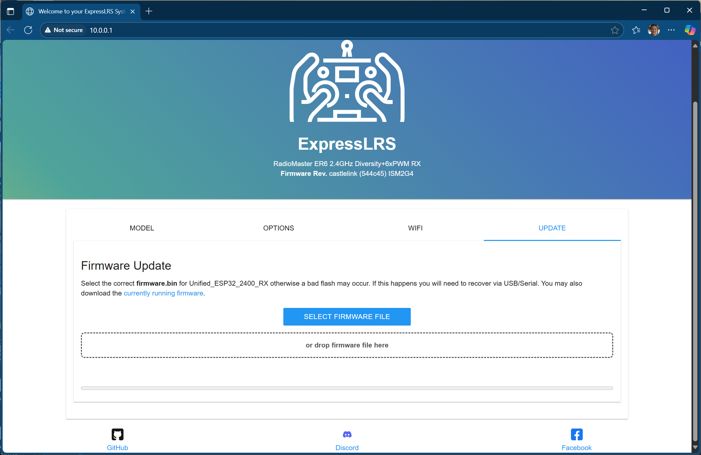
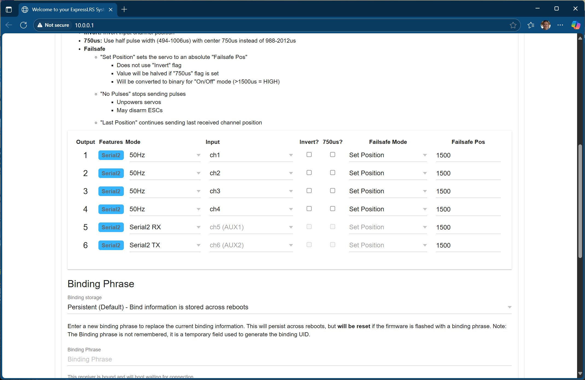
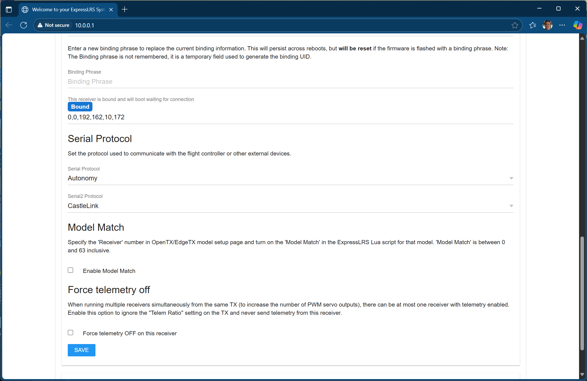
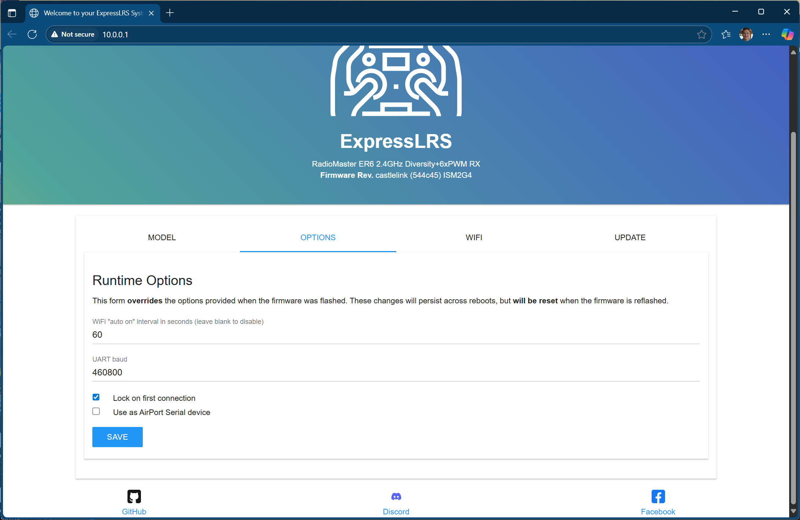
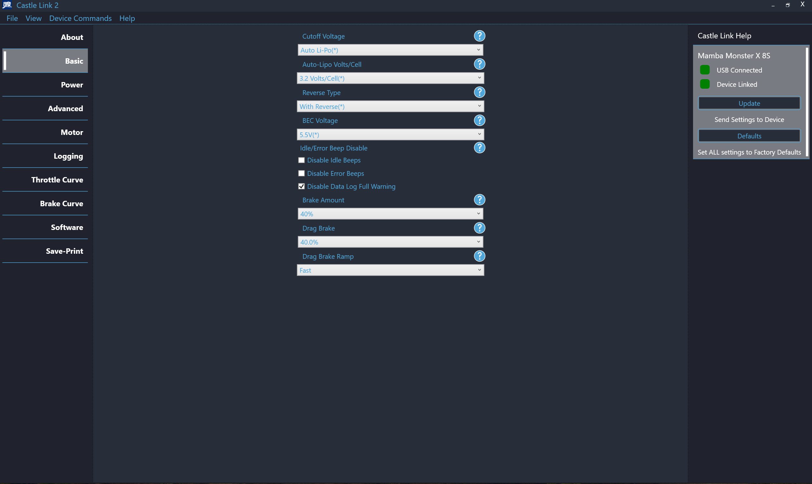
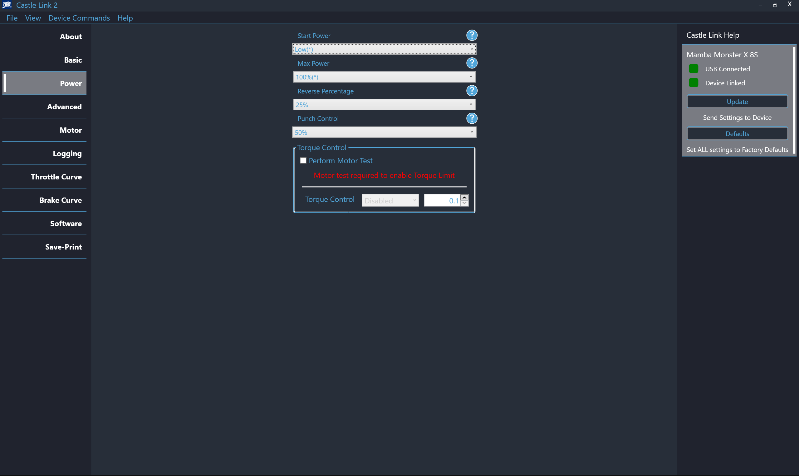
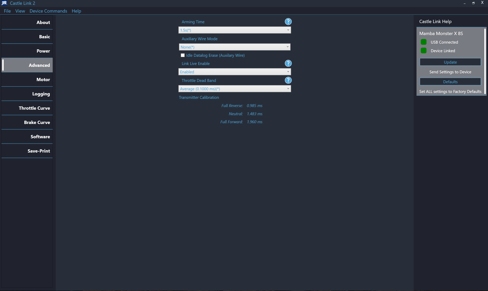
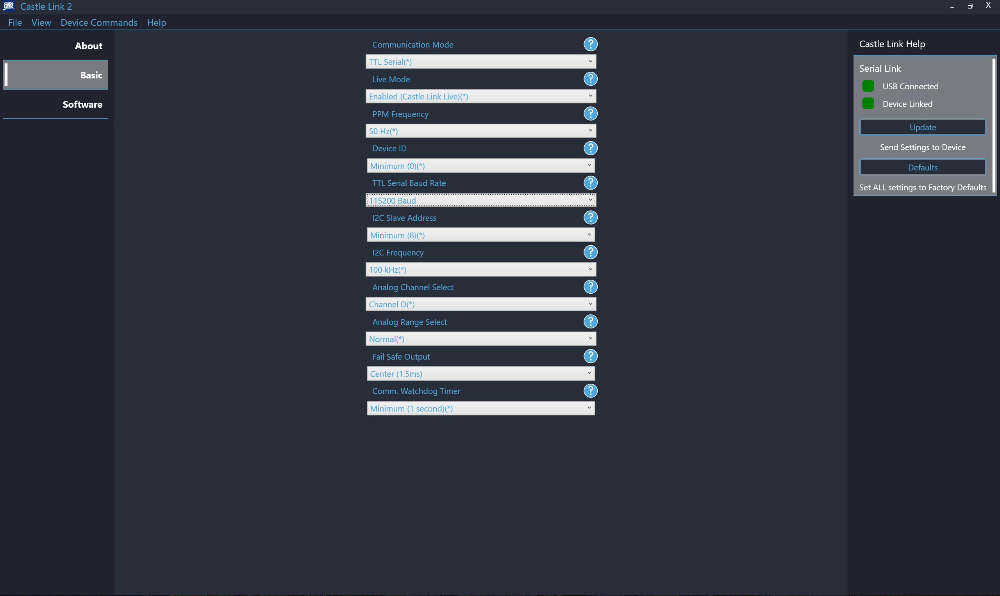
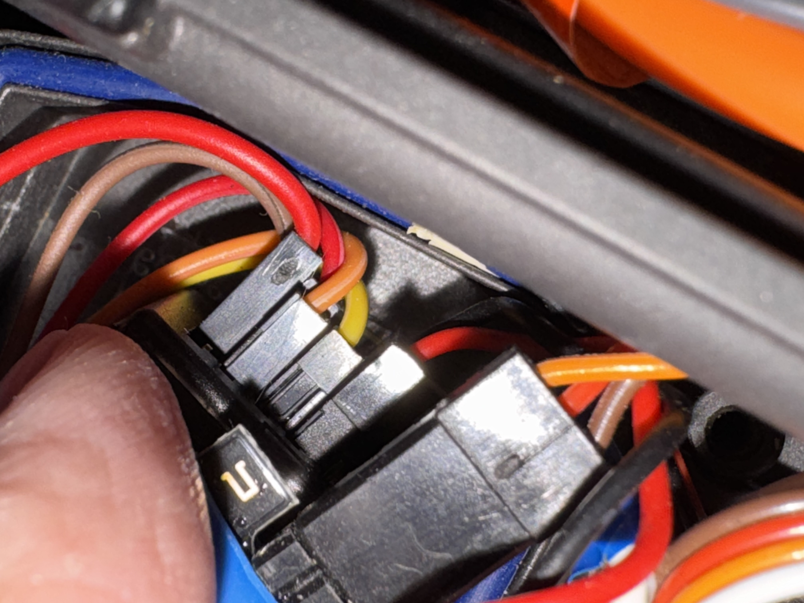
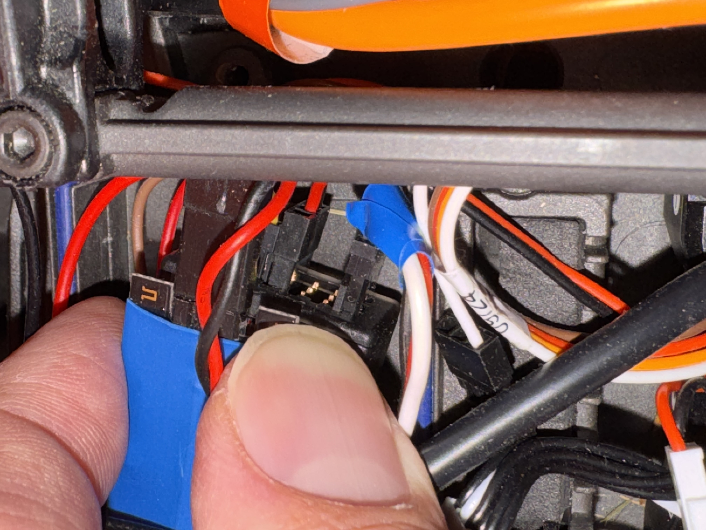

# XMAXX Autonomy CastleLink <---> ELRS Setup

## Flash and Configure Firmware

### Flash custom firmware to the ER6
- The ER6 will need to be powered up.  This can be done by using the ESC directly (just plugging in to any of the ports), or by otherwise providing ~5.5V.
- Power up the ER6 and wait for ~30s. It should start a wireless AP with SSID 'ExpressLRS RX'.  The password is 'expresslrs'
- Go the the configuration page at http://10.0.0.1
- Go to the 'update' page and upload and flash the firmware image `RM_ER6_ERLS_RX_firmware/firmware_Unified_ESP32_2400_RX_via_UART.bin`

- Reboot and reconnect
- Change the configuration to match the following:
- **Model**

- *Note that the RX and TX here should correspond to the Serial Link TX and RX (e.g. RX-->TX, TX-->RX)*

- **Options**

- Save the configuration

### Update the ESC Configuration
- Using the CastleLink USB adapter, configure the ESC using  **CastleLink 2** available here: [https://home.castlecreations.com/download-castle-link]
- Make the following configuration changes
- **Basic**

- **Power**

- **Advanced**
- This is critical as it is what enables LiveLink between the ESC and the SerialLink board

### Update the SerialLink Configuration
- Using the CastLink USB adapter, configure the SerialLink board using **CastleLink Classic** available here: [https://home.castlecreations.com/download-castle-link]
- Make the following configuration changes

- *Note CastleLink 2 (shown in the image) is able to read the configuration, but is not able to write it (despite appearing to do so in the UX).  CastleLink Classic is necessary to successfully write the config.*

## Wire up the hardware

- Ultimately, the ESC connects to the SerialLink board via the standard 3-wire cable (and talks the LiveLink protocol).
- The SerialLink then connects to the ER6 via a UART.
- The ESC provides power to both the SerialLink board and the ER6 - **as well as the steering servo**.
- As such, although the SerialLink board has a +V on the 'ER6 side', the +V traces in the board cannot carry enough current to keep the steering servo happy.  So you will need to add a wire from the 'ESC side' +V to any of the +V lines on the ER6.
- From the 'ER6 side' of the SerialLink, you will need to wire, RX, TX, and GND over to the ER6.
- On the ER6, it should look like this:

- Far right, Power (extra wire from +V 'ESC side' of the SerialLink) and GND from the SerialLink
- Next, Port 6 signal, ER6 TX, SerialLink RX (orange in the pic)
- Next, Port 5 signal, ER6 RX, SerialLink TX (yellow in the pic)
- Next - Port 4, ESC fan power - ignore if you don't have a fan

- Finally, Port 1 - steering servo

