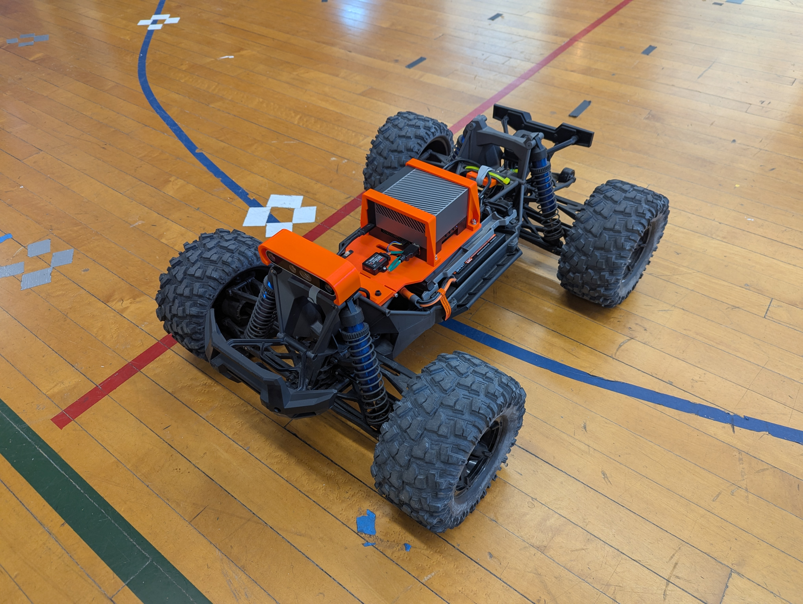

# xmaxx_autonomy
The purpose of this repo is to provide documentation on the consutrction of an autonomous platform using the Traxxas XMAXX platform as a base.

This is very much a *work in progress*.

## Platform Parts List (Main)
| Part  | Description | Link | Cost Estimate |
| ---------- | ---------- | ---------- | ---------- |
| Traxxas XMAXX 8s | Base RC platform | https://traxxas.com/products/landing/x-maxx/ | $1099.95 |
| Castle Mamba X 8S 33.6V ESC W /1717-1260KV Sensored Motor | Replacement ESC and sensored motor for telemetry and low-speed control | https://www.castlecreations.com/en/1-6th-scale/mamba-monster-x-8s-33-6v-esc-w-1717-1260kv-sensored-motor-010-0165-03 | $389.95 |
| M2C Racing 110 X Series Motor Mount | Mount to install new motor in XMAXX | https://m2cracing.net/shop/shop.php#!/M2C-1100-X-SERIES-MOTOR-MOUNT-AND-SLIDE-WITH-M2C-PERFECT-MESH/p/478044738 | $108.72
| Castle Serial Link | Provides telemetry and control via serial | https://www.castlecreations.com/en/serial-link-010-0121-00 | $76.50 |
| Castle Link V3 USB Programming Kit | Used to set configuration on the ESC | https://www.castlecreations.com/en/castle-link-v3-usb-programming-kit-011-0119-00 | $21.95 |
| RadioMaster MT12 Surface Radio Controller (ERLS) | Manual ERLS RC controller | https://www.radiomasterrc.com/collections/surface-radio/products/mt12-surface-radio-controller | $129.99 |
| RadioMaster ER6 2.4GHz ELRS PWM Receiver | Receiver and controller that will be flashed with custom ERLS autonomy firmware | https://www.radiomasterrc.com/collections/receivers/products/er6-2-4ghz-elrs-pwm-receiver | $24.99 | 
| Smart Powerstage 8S Surface Bundle: (2) G2 5000mAh 4S LiPo IC5 & S2100 Charger | Batteries and charger | https://www.spektrumrc.com/product/smart-powerstage-8s-surface-bundle-2-g2-5000mah-4s-lipo-ic5-and-s2100-charger/SPMXPSS850.html | $354.99 |
| Spektrum Connector IC5 | Batter connector to be soldered onto ESC wires | https://a.co/d/7pLiS2Y | $11.99 |

** Unfortunately, the replacement motor requires some physical alterations to the XMAXX plastic chassis to fit.  Hence a dremel will be necessary to remove two supports, and cut away some material on the stock gear mesh cover.  It's not ideal, but there does not seem to be a sensored motor with telemetry that fits in the stock slot without mods.  If this is a show stopper, another possible chassis is the Arrma Kraton (https://www.arrma-rc.com/en/product/1-5-kraton-8s-exb-avc-4x4-rtr-brushless-speed-truck-black/ARA5808V2T1.html).  It looks like the standard motor mount on this platform would take the new motor without modification - but this has not yet been investigated. The platform sits a bit lower, and a new mount would need to be designed. **

## Platform Parts List (Sensors)
| Part  | Description | Link | Cost Estimate |
| ---------- | ---------- | ---------- | ---------- |
| Intel Realsense D456 | Depth vision camera | https://store.intelrealsense.com/buy-intel-realsense-depth-camera-d456.html | $469.00 |
| Microstrain 3DM-GX5-25 | AHRS IMU (Optional - D456 has internal IMU but competes for USB bandwidth) | https://www.microstrain.com/inertial-sensors/3dm-gx5-25 https://www.mouser.com/ProductDetail/MicroStrain-by-HBK/3DM-GX5-AHRS-40G-900-DPS?qs=3Rah4i%252BhyCFocmOEloIKug%3D%3D | $2045.38 |
| SparkFun GNSS-RTK L1/L5 Breakout - NEO-F9P | L1/L5 GPS w/USB interface | https://www.sparkfun.com/sparkfun-gnss-rtk-l1-l5-breakout-neo-f9p-qwiic.html | $249.95 |
| GNSS L1/L5 Multi-Band High Precision Antenna - 5m (SMA) | L1/L5 GPS antenna | https://www.sparkfun.com/gnss-l1-l5-multi-band-high-precision-antenna-5m-sma.html | $60.00 |

** Instead of the AHRS/IMU/GPS setup above, this could be replaced by something like the VectorNav VN-300 (https://www.vectornav.com/products/detail/vn-300) - although these are not cheap: ~5K (https://www.vectornav.com/store/products/dual-gnss-ins/p/vn-300-rugged-dual-gnssins) **

## Platform Parts List (Compute)
| Part  | Description | Link | Cost Estimate |
| ---------- | ---------- | ---------- | ---------- |
| Jetson AGX Orin 64GB Developer Kit | GPU Compute | https://www.arrow.com/en/products/945-13730-0050-000/nvidia?nvid=em-945-13730-0050-000 | $1999.00 |
| SAMSUNG 990 PRO SSD 2TB | Storage for Orin - Many options here | https://a.co/d/33MjdJy | $179.99

## Platform Parts List (Wires and Connectors)
| Part  | Description | Link | Cost Estimate |
| ---------- | ---------- | ---------- | ---------- |
| GH1.25 to Dupont2.54 Pre-Crimped Cables and Connectors Kit Compatible with JST GH 1.25mm for Pixhawk4 Pixhawk 6C 6X 20cm Silicone Wire | Wire kit for cable from ER6 to Orin | https://a.co/d/4mtFtRP | $19.99 |
| M3 / M4 Nuts and Bolts | Connecting all the things - something like this at Amazon | https://a.co/d/4Z7bRa4 | $9.99 |
| 50mm M3 Bolts | You'll need 2 of these for the hinge - something like this at Amazon | https://a.co/d/0kqJr4s | $7.99 |
| M4 rubber washers | These are for spacing with the main mount - something like this at Amazon | https://a.co/d/5ORINJq | $7.99 |
| EC5 Male to XT60 Female Adapter | Battery cable to Orin | https://a.co/d/8FEJKTv | $9.99 |
| XT60 Male to Male DC 5.5mm x 2.5mm Cable | Batter cable to Orin | https://a.co/d/5boBf6K | $10.99 |
| Right angle USB-C adapter | For D456 cable - something like this on Amazon | https://a.co/d/9OtB0vA | $8.61 |
| High quality USB-C to USB-C cable for D456 | Something like this on Amazon | https://a.co/d/47YHbUF | $25.99 |
| USB-C to USB-A for GPS connection | Something like this on Amazon | https://a.co/d/cIZYpWn | $5.99 |
| 20awg RC wire | Something like this on Amazon - will be cut up | https://a.co/d/dIKhoX0 | $14.99 |
| Spectrum XBC100 Smart Battery Checker | Optional | https://a.co/d/jaZsQSk | $44.99 |
| Spektrum IC5 to IC3 Adapter | Optional - for battery tool | https://a.co/d/ib37hAt | $14.99 |
| Velcro Wraps | These are helpful - something like this on Amazon | https://a.co/d/88yIFMP | $10.81 |
| Microstrain short cable | Optional if you want to build a shorter cable for the Microstrain | https://www.mouser.com/ProductDetail/MicroStrain-by-HBK/MICRO-DB9-LEADS?qs=DPoM0jnrROVExKPQkf4YSQ%3D%3D | $75.97 |
| Microstrain short cable USB | Optional if you want to build a shorter cable for the Microstrain | https://a.co/d/herxRRp | $6.88 |
